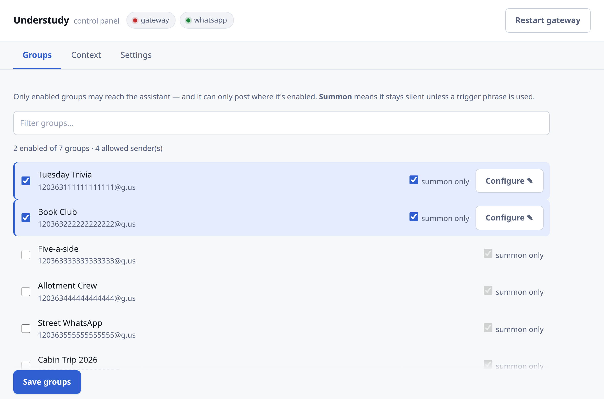
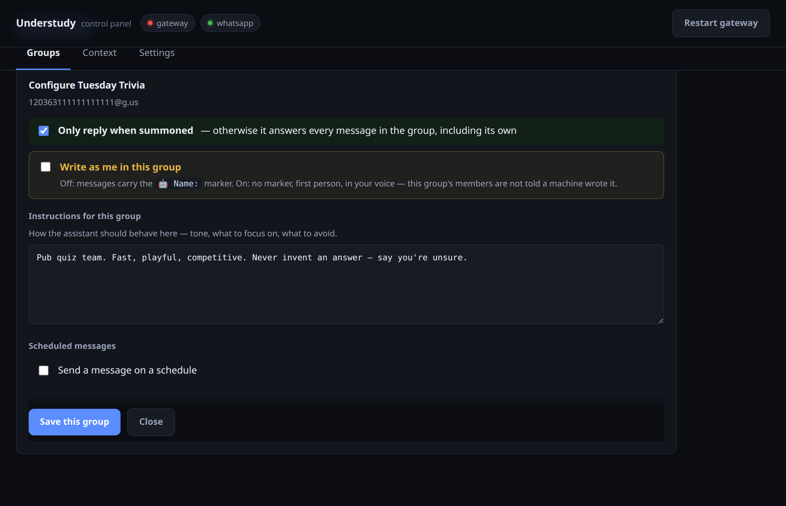
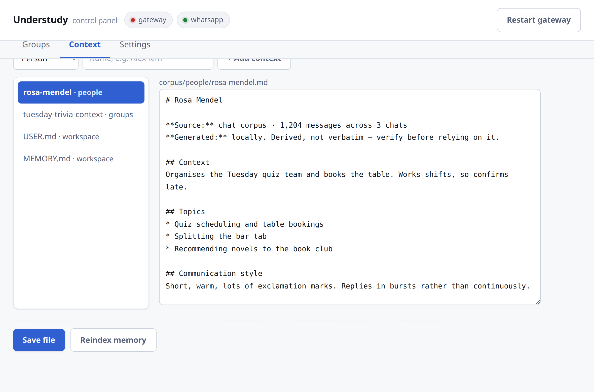
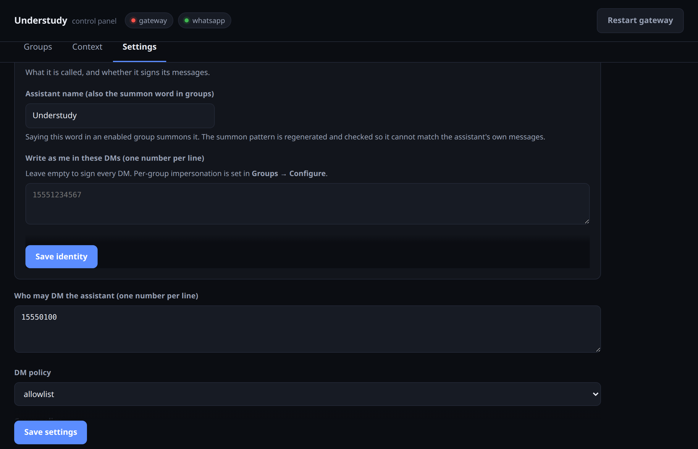

# Agent Understudy

A self-hosted personal assistant that reads and replies to your WhatsApp, built on
[OpenClaw](https://docs.openclaw.ai/). Runs on a **local model** (Ollama) or a
**hosted API** (Anthropic / OpenAI) — your choice at setup.

It builds a searchable memory from your own chat history: exported conversations are
parsed into session-chunked markdown, summarised into per-person and per-group context
cards, and indexed into SQLite FTS5 + sqlite-vec. No external vector database.

On top of that sits a **temporal layer** — every remembered fact carries the date it
refers to, so the assistant can tell a plan from a memory of one. Cards are refreshed
incrementally: a week of new messages rebuilds a month of one chat, not the corpus.

> **Read this first.** WhatsApp has no sanctioned automation path for personal
> accounts. This connects via WhatsApp Web (Baileys) as a linked device, which is
> against WhatsApp's terms and can get your number banned. Enforcement correlates
> strongly with spam and cold outreach, so a reactive reply-only assistant is the
> lowest-risk profile — but the risk is not zero and it is **your personal number**.
> The `actions.sendMessage: false` default keeps it reply-only. Consider a spare
> number. Anyone you talk to will be talking to an LLM without being told, unless you
> keep the attribution prefix on.

## Why this exists

OpenClaw is built around frontier APIs, where a model call returns in ~1s. Point it at
a local 27B and a lot of assumptions break quietly. Most of this repo is the
scaffolding that makes that combination behave — and a guard layer that exists because
each of its rules corresponds to a real message that reached a real group chat.

## Quickstart

```bash
# 1. install OpenClaw  (the flags matter: npm blocks the bundled-plugin postinstall)
npm install -g --allow-scripts=openclaw,@google/genai,koffi,tree-sitter-bash,protobufjs openclaw@latest

# 2. clone and configure
git clone <this-repo> agent-understudy && cd agent-understudy
./setup.sh                      # pick ollama | anthropic | openai

# 3. install the WhatsApp channel and link a device
openclaw plugins install clawhub:@openclaw/whatsapp
openclaw channels login --channel whatsapp      # needs a TTY; scan the QR

# 4. check everything
./diag.sh
python3 guard/invariants.py
```

### Local models (Ollama)

```bash
ollama pull qwen3:8b
ollama pull qwen3-embedding:0.6b
ollama create qwen3-24k -f ollama/Modelfile.qwen27b-24k   # see ollama/README.md
systemctl --user enable --now ollama-nothink.service      # REQUIRED for reasoning models
```

The proxy is not optional if your model reasons. OpenClaw never sends `think: false`,
so Qwen3/DeepSeek-R1 return their chain-of-thought as ordinary message content, and it
gets delivered into your chat. `proxy/ollama_nothink.py` injects the flag.

### Hosted API

```bash
export ANTHROPIC_API_KEY=sk-ant-...     # or OPENAI_API_KEY
./setup.sh --provider anthropic
```

No proxy needed. Defaults to `claude-opus-5`; `claude-sonnet-5` and
`claude-haiku-4-5` are cheaper. Hosted models follow instructions far more reliably
than a local 8B, which matters more than it sounds — see Known limits.

## Building the memory

```bash
# export chats from your phone: open chat -> ⋮ -> Export chat -> Without media
cp "WhatsApp Chat - Foo.zip" corpus/raw/
cp contacts.csv corpus/raw/            # optional: resolves numbers to names
./ingest/run.sh
```

`ingest/run.sh` parses exports into session-chunked markdown (grouped by conversational
gap, not fixed size — fixed chunks slice exchanges into incoherent fragments), builds
profile cards on your model, applies contact names, and reindexes.

Phone export gives you the **full** history. A linked-device capture
(`ingest/capture_history.mjs`) only yields what WhatsApp pushes on an initial pair —
about 12 days in testing.

## The temporal layer

A summary card states that someone is "planning a ride on Saturday the 13th" with the
same confidence whether that Saturday is next week or fifteen months gone. The model
cannot tell the difference — it is not given today's date, and the card has no dates in
it at all. So the assistant cheerfully brings up a trip that already happened, or treats
a cancelled plan as live.

`ingest/build_temporal.py` writes a dated timeline card per chat and per person:

- **Every fact carries two dates** — when it happened, and which month it was learned
  in. That is what lets a later statement override an earlier one without asking a
  model to reconcile them.
- **Recency is computed at read time**, never stored. A card written in June does not
  still claim June is current when it is read in October; facts fall through
  *this month* → *recent* → *may be out of date* → *archive* on their own.
- **Open threads are resolved, not just listed.** A commitment is matched forward
  through later months and comes out as `open`, `date passed`, or `went quiet`.
- **The free half needs no model at all.** First and last seen, per-month volume as a
  sparkline, activity trend, peak hours, who talks to whom — counted, not inferred, so
  it is the part that is never wrong. `--no-llm` builds only this.

```bash
python3 ingest/build_temporal.py --no-llm    # deterministic only, no GPU
python3 ingest/test_temporal.py              # offline, no model, no network
```

## Incremental refresh

A full rebuild reads every message with a 27B and takes hours; almost none of that work
is new. Extraction is keyed to **calendar months**, not a sliding window — a "last 30
days" window changes contents daily, so anything derived from it must be rebuilt daily,
which at a few hundred groups is the whole corpus every night. A closed month is frozen
the moment it ends, so the model reads it exactly once, ever. Steady state is one call
per active chat per month.

Cards follow the same rule through `corpus/.manifest.json`, which hashes the messages
that feed each card — not file mtimes, since re-parsing an unchanged export rewrites
every file. A card is rebuilt when its inputs change by more than `--min-delta`
messages, so one new message does not trigger a 27B rewrite of the corpus.

```bash
python3 ingest/refresh.py            # plan only: what would rebuild, and what it costs
python3 ingest/refresh.py --apply    # do it
```

It plans by default and spends nothing. On a shared GPU it refuses to start while
another model is resident (pass `--shared` to override) and unloads what it loaded when
it finishes.

## The control panel

`python3 web/server.py` → `http://127.0.0.1:8765` (loopback only). Every config write
is validated and rolled back if it would not load.

### Groups

Pick which groups the assistant may hear and reply in. *Summon only* keeps it silent
unless the trigger word is used — leave it on.



### Per-group configuration

Instructions, impersonation and scheduled messages, set per conversation.



### Context

The memory the assistant retrieves from — per-person and per-group cards, plus the
workspace files. Edit and reindex in place.



### Settings

Identity, allowlists, the summon phrase, and how much history each turn carries.



*Screenshots use fictional people and groups.*

## Identity and impersonation

Set in the control panel (`python3 web/server.py` -> Settings -> Identity):

- **Assistant name** — also the summon word in groups. Changing it regenerates the
  mention pattern and verifies the new pattern cannot match the assistant's own
  output. Default `Assistant`.
- **Write as me (impersonation)** — set **per conversation**, off by default.
  Per group in *Groups → Configure*; per DM in *Settings → Identity*. A signed
  conversation carries a `🤖 Name:` prefix; an impersonated one has no marker and
  is written in the first person in your voice.

Three things to know before turning it on:

1. **Recipients are not told a machine wrote the message.**
2. **It takes the marker off channel-wide.** OpenClaw applies `responsePrefix`
   globally and `groups.<jid>` has `additionalProperties: false`, so there is no
   per-conversation prefix. The moment one conversation is impersonated the
   code-applied marker comes off everywhere, and signed conversations fall back to
   an instruction a model can miss.
3. **It weakens the loop guard.** The summon pattern works by excluding the
   attribution prefix; with no prefix, the assistant writing its own name
   re-triggers it. `guard/watchdog.py` becomes the backstop.

Impersonated conversations run the `impersonation` guard profile
(`guard/gate.py`), currently identical to `assistant` but separate so the two can
diverge.

## The guard layer

`python3 guard/test_guard.py` — offline, no model, no network.

| Guard | What it stops |
| --- | --- |
| `guard/gate.py` | Narration, deliberation, tool/runtime chatter, over-long replies. Applied in the proxy. |
| `guard/watchdog.py` | Runaway send loops. OpenClaw's `botLoopProtection` **does not cover WhatsApp**. |
| `guard/invariants.py` | Config mistakes that fail silently. Wired as `ExecStartPre`. |
| URL preflight | Invented image URLs (models hallucinate plausible ones that 404). |
| Staleness cutoff | Replies to a backlog. WhatsApp redelivers everything missed while the gateway was down, and OpenClaw replays it through the normal path — so a restart answers messages whose authors moved on hours ago. `UNDERSTUDY_STALE_MIN` (default 30). |

Read `guard/README.md` before enabling any group.

## Gotchas this repo encodes

Things that cost real debugging time, in case they save you some:

- **`groupAllowFrom` matches the *sender*, not the group.** Listing only group JIDs
  means every group message is silently blocked.
- **An emoji in a mention pattern gets the whole pattern rejected**
  (`Ignoring unsupported group mention pattern`) — leaving zero patterns, so nothing
  can summon it, with no error at the call site.
- **A mention pattern that matches the bot's own output loops forever.** This produced
  93 messages to one group. Nothing in OpenClaw stops it on WhatsApp.
- **`blockStreamingDefault` defaults to on**, splitting one reply into several chat
  messages — including half-formed reasoning emitted before the answer.
- **The heartbeat is a cron job, not a setting.** It DMs you every 30 minutes and
  `openclaw cron disable` refuses it ("system-owned"). Silence it via
  `agents.defaults.heartbeat`.
- **`tools.loopDetection` defaults to false.** With it off, one trivial reply took 18
  model calls.
- **Nothing in OpenClaw caps how old an inbound message may be.** Reconnecting after
  an outage replays the backlog as if it were live. In a 200-person group that is a
  burst of replies to stale threads — the shape of the loop incident, from a different
  cause. The proxy carries the cutoff because OpenClaw exposes no inbound hook.
- **Ollama's `/v1` OpenAI-compatible endpoint breaks tool calling** — it emits
  `tool_calls` as plain text. Use the native API.
- **`web_fetch` blocks private IPs**, so an agent cannot reach a localhost helper.
- **`openclaw cron list --json` prints a docs footer after the JSON**; the schedule
  field is `expr`, not `expression`.
- **Context**: OpenClaw's system prompt runs ~8k tokens before your history. A 16k
  context window overflows and truncates mid-sentence (`stopReason=length`).
- **Nothing tells the model what today is.** Without it, every dated fact in memory
  reads as equally current — which is the whole reason the temporal layer exists.

## Layout

```
guard/      output gate, rate limiter, config invariants, tests
ingest/     export parser, profile/context/timeline builders, incremental refresh
proxy/      Ollama no-think proxy (also where the output gate is enforced)
web/        local control panel on :8765
ollama/     Modelfiles with pinned context sizes
config/     your config (gitignored) + examples/ templates
corpus/     your data (gitignored)
```

`./diag.sh` for health, `./logs.sh -f` for readable logs (OpenClaw writes JSON-lines).

## Known limits

- **Small local models are the weak link.** An 8B ignores instructions the guard then
  has to catch. A 27B is markedly better and a hosted model better still.
- **Latency**: ~40-75s per reply on a 27B on 2×3090. Hosted APIs are seconds.
- **Attribution is only enforced on replies** (`responsePrefix` is applied by code).
  Scheduled sends rely on an instruction the model can ignore.
- **Images** need a real image-search API; keyless sources cover reference photos, not
  news.
- **Slack** is configurable but this repo has focused on WhatsApp.
- **Retrieval is flat.** Top-k over a single index holds fine for a handful of chats;
  past roughly 25 groups, six chunks out of tens of thousands stops discriminating, and
  cross-chat identity (one person, several names and numbers) needs a graph rather than
  embeddings. The temporal layer is a prerequisite for that, not a substitute.

## License

MIT — see [LICENSE](LICENSE). Not affiliated with WhatsApp, Meta, Anthropic, OpenAI,
or OpenClaw.
